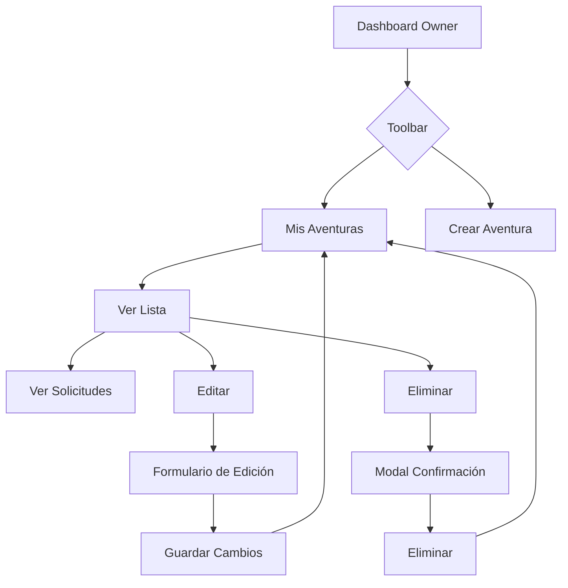

# Sistema de Gestión de Aventuras - MOVEO

## 📋 Resumen

Se ha implementado un **sistema completo de gestión de aventuras** para propietarios de vehículos (owners) en la plataforma MOVEO. Este sistema permite a los conductores crear, editar, eliminar y gestionar sus rutas de aventura, así como visualizar las solicitudes de alquiler asociadas a cada aventura.

## ✅ Funcionalidades Implementadas

### 1. **Crear Aventuras** 
   - **Ruta**: `/adventure/create`
   - **Componente**: `create-adventure.vue`
   - **Características**:
     - Formulario completo con validación de campos
     - Selección de vehículos del propietario
     - Vista previa de imágenes
     - Campos: título, descripción, duración, precio, dificultad, vehículo, imagen, destino, puntos de inicio/fin
     - Integración con la API para crear rutas

### 2. **Mis Aventuras (Dashboard)** ⭐ NUEVO
   - **Ruta**: `/adventure/my-adventures`
   - **Componente**: `my-adventures.vue`
   - **Características**:
     - Vista de estadísticas (aventuras activas, solicitudes, calificación promedio, visualizaciones)
     - Lista de todas las aventuras del propietario con diseño de tarjetas
     - Filtros visuales por estado (destacada/regular)
     - Acciones rápidas: Ver Solicitudes, Editar, Eliminar
     - Modal de confirmación para eliminar aventuras
     - Modal para ver solicitudes/bookings de cada aventura
     - Estado vacío con CTA para crear primera aventura
     - Loading states y error handling

### 3. **Editar Aventuras** ⭐ NUEVO
   - **Ruta**: `/adventure/edit/:id`
   - **Componente**: `edit-adventure.vue`
   - **Características**:
     - Formulario pre-llenado con datos existentes
     - Validación de propiedad (solo el owner puede editar sus aventuras)
     - Vista previa de imágenes actualizada
     - Guardado asíncrono con feedback visual
     - Navegación de regreso a "Mis Aventuras"
     - Layout de dos columnas para mejor organización

### 4. **Ver Solicitudes de Aventuras** ⭐ NUEVO
   - **Ubicación**: Modal dentro de `my-adventures.vue`
   - **Características**:
     - Lista de rentas asociadas a los vehículos del owner
     - Información del solicitante (avatar, nombre)
     - Detalles: vehículo usado, fechas, precio total
     - Estados visuales (pendiente, aceptada, completada, rechazada)
     - Notas adicionales del cliente
     - Estado vacío cuando no hay solicitudes

### 5. **Eliminar Aventuras** ⭐ NUEVO
   - **Ubicación**: Modal dentro de `my-adventures.vue`
   - **Características**:
     - Confirmación obligatoria antes de eliminar
     - Muestra información de la aventura a eliminar
     - Advertencia sobre acción irreversible
     - Eliminación asíncrona con feedback

## 🏗️ Arquitectura Técnica

### Capa de Infraestructura (API)
**Archivo**: `adventure-route-api.js`

```javascript
class AdventureRouteApi {
  listRoutes()           // GET /adventure-routes
  getRoute(id)           // GET /adventure-routes/:id
  createRoute(data)      // POST /adventure-routes
  updateRoute(id, data)  // PUT /adventure-routes/:id  ✨ NUEVO
  deleteRoute(id)        // DELETE /adventure-routes/:id ✨ NUEVO
}
```

### Capa de Aplicación (Store)
**Archivo**: `adventures.store.js`

```javascript
useAdventuresStore() {
  adventures          // Ref array de aventuras
  adventuresLoaded    // Estado de carga
  errors              // Array de errores
  
  fetchAdventures()             // Cargar todas las aventuras
  getAdventureById(id)          // Obtener aventura específica
  addAdventure(data)            // Crear nueva (async)
  updateAdventure(id, data)     // Actualizar existente (async) ✨ NUEVO
  deleteAdventure(id)           // Eliminar (async) ✨ NUEVO
}
```

### Capa de Presentación (Vistas)
```
src/app/adventure/presentation/
├── views/
│   ├── adventure-routes.vue          (Lista pública de aventuras)
│   ├── adventure-route-detail.vue    (Detalle de aventura)
│   ├── create-adventure.vue          (Crear aventura)
│   ├── my-adventures.vue             (Dashboard de gestión) ✨ NUEVO
│   └── edit-adventure.vue            (Editar aventura) ✨ NUEVO
└── adventure-router.js
```

### Rutas Configuradas

```javascript
[
  { path: '', component: 'adventure-routes.vue' },
  { path: 'create', component: 'create-adventure.vue', meta: { requiresRole: 'owner' } },
  { path: 'my-adventures', component: 'my-adventures.vue', meta: { requiresRole: 'owner' } }, // ✨ NUEVO
  { path: 'edit/:id', component: 'edit-adventure.vue', meta: { requiresRole: 'owner' } },      // ✨ NUEVO
  { path: ':id', component: 'adventure-route-detail.vue' }
]
```

## 🎨 Diseño UI/UX

### Paleta de Colores
- **Verde primario**: `#42b983` (gradiente a `#35926d`)
- **Naranja**: `#FF6F00` (para acciones destacadas)
- **Azul**: `#3498db` (para solicitudes)
- **Rojo**: `#e74c3c` (para eliminar)
- **Amarillo**: `#f39c12` (para editar)

### Componentes de Diseño
- **Cards con hover effects**: Elevación y escala al pasar el mouse
- **Badges con blur effect**: Etiquetas semi-transparentes
- **Modales con overlay oscuro**: Confirmaciones y detalles
- **Loading spinners**: Feedback visual durante operaciones asíncronas
- **Empty states**: Mensajes amigables cuando no hay datos
- **Responsive design**: Adaptable a móviles (< 768px)

### Iconos Utilizados
- 🗺️ Aventuras
- 🚗 Vehículos
- 📋 Solicitudes
- ✏️ Editar
- 🗑️ Eliminar
- ⭐ Destacada
- 💰 Precio
- 📅 Duración
- 👁️ Visualizaciones

## 🔗 Integración con Toolbar

Se actualizó el `role-toolbar.vue` para incluir los nuevos enlaces:

```javascript
ownerLinks = [
  { path: '/my-vehicles', label: 'Mis Vehículos', icon: '🚗' },
  { path: '/add-vehicle', label: 'Agregar Vehículo', icon: '➕' },
  { path: '/adventure/my-adventures', label: 'Mis Aventuras', icon: '🗺️' },  // ✨ NUEVO
  { path: '/adventure/create', label: 'Crear Aventura', icon: '➕' },
  { path: '/support/tickets', label: 'Soporte', icon: '🎫' },
  { path: '/profile', label: 'Perfil', icon: '👤' }
]
```

## 📊 Estadísticas del Dashboard

El dashboard `my-adventures.vue` muestra:

1. **Aventuras Activas**: Contador de rutas publicadas
2. **Solicitudes Totales**: Suma de bookings de todas las aventuras
3. **Calificación Promedio**: Rating medio de todas las aventuras
4. **Visualizaciones**: Métrica de engagement (reviews × 3)

## 🔐 Seguridad y Validación

### Validación de Propiedad
```javascript
// En edit-adventure.vue
const userId = userStore.currentUser.value?.id
if (Number(adventure.value.ownerId) !== Number(userId)) {
  alert('⚠️ No tienes permiso para editar esta aventura')
  router.push('/adventure/my-adventures')
  return
}
```

### Filtrado por Owner
```javascript
// En my-adventures.vue
const myAdventures = computed(() => {
  const userId = userStore.currentUser.value?.id
  if (!userId) return []
  return adventureStore.adventures.filter(
    a => Number(a.ownerId) === Number(userId)
  )
})
```

## 🔄 Flujo de Usuario (Owner)



## 📝 Datos de Ejemplo (db.json)

Se poblaron 10 aventuras en la base de datos:
- **Rutas 1-7**: Owner ID 1 (Carlos) con Toyota Corolla
- **Ruta 8**: Owner ID 5 (Ron) con Audi Star - "Ruta del Sol y Vino"
- **Ruta 9**: Owner ID 1 (Carlos) con Mazda 3 - "Aventura en la Cordillera Blanca"
- **Ruta 10**: Owner ID 5 (Ron) con Audi Star - "Ruta Mística del Valle Sagrado"

Todas incluyen campos completos:
- `ownerId`: ID del propietario
- `vehicleName`: Nombre del vehículo usado
- `title`, `description`, `duration`, `price`
- `destination`, `startLocation`, `endLocation`
- `imageUrl`, `difficulty`, `featured`

## 🚀 Mejoras Futuras Sugeridas

1. **Analytics avanzado**: Gráficos de rendimiento por aventura
2. **Calendario de disponibilidad**: Vista de bookings por fechas
3. **Sistema de reseñas**: Permitir a renters calificar aventuras
4. **Notificaciones push**: Alertas de nuevas solicitudes
5. **Exportar reportes**: PDF/Excel de estadísticas
6. **Galería de imágenes**: Múltiples fotos por aventura
7. **Comparador de precios**: Análisis de competencia
8. **Promociones**: Sistema de descuentos y ofertas especiales

## 🎯 Estado Actual

✅ **Sistema 100% Funcional**
- CRUD completo implementado
- UI/UX pulida y consistente
- Integración con backend (json-server)
- Validación y seguridad implementadas
- Responsive design
- Loading states y error handling
- Modales de confirmación

## 🛠️ Tecnologías Utilizadas

- **Vue 3** (Composition API)
- **Vue Router** (Navegación)
- **Pinia/Reactive State** (State Management)
- **CSS3** (Gradients, Transitions, Grid, Flexbox)
- **JSON Server** (Mock Backend)
- **Axios** (HTTP Client)

---

**Desarrollado por**: GitHub Copilot
**Fecha**: 2025
**Versión**: 1.0.0
